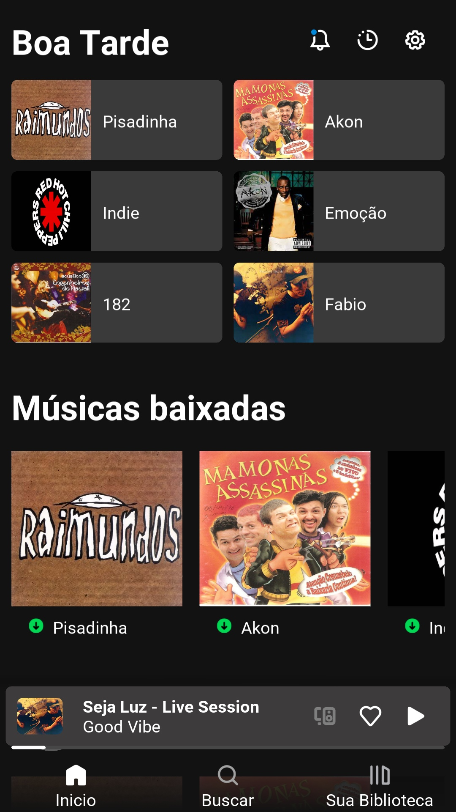
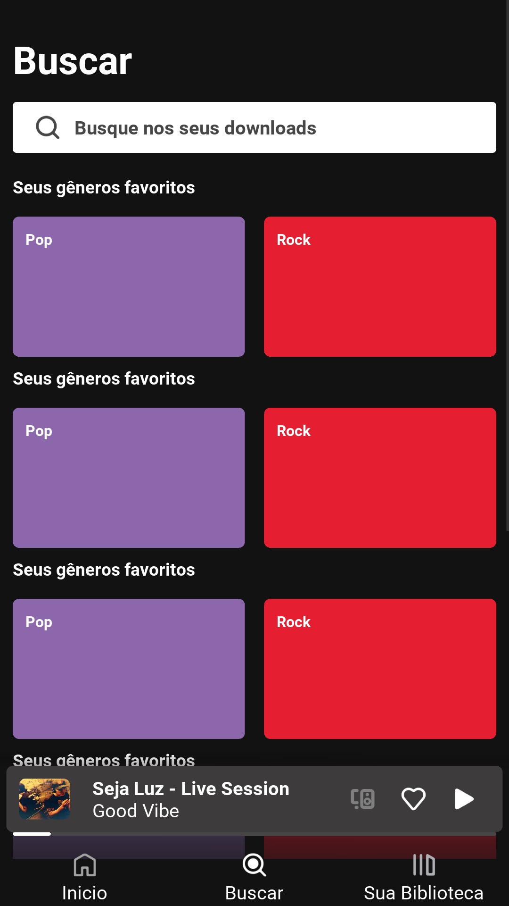
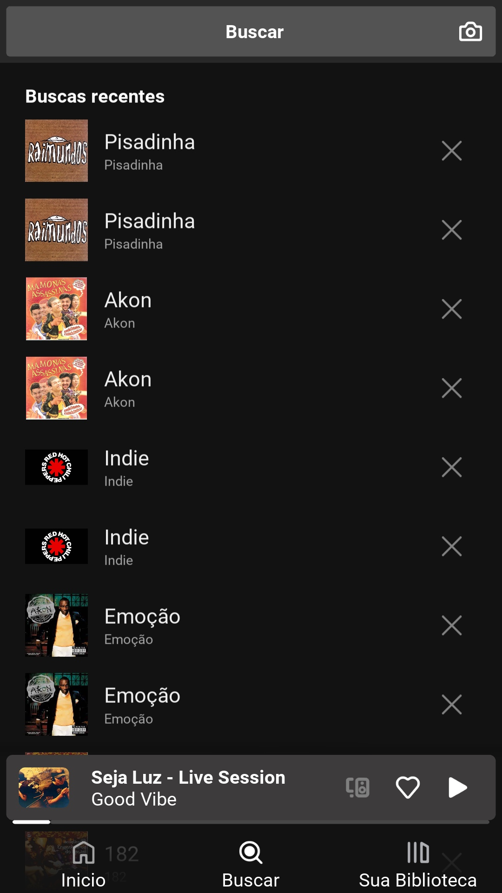

# SpotifyClone
Clone do Spotify feito com Kivy e Python

Fiz esse projeto para treinar e trazer bons conteudos para o meu canal.

Caso queira dar uma olhada na PlayList:
 - Primeiro Vídeo: https://youtu.be/X2p9O3L0rB0
 - PlayList https://youtube.com/playlist?list=PLz7mQFeTpQVlH-Mce68_AeQlK-YbvMkp3

# Primeira Tela

# Tela de Busca

# Tela de buscas recentes

